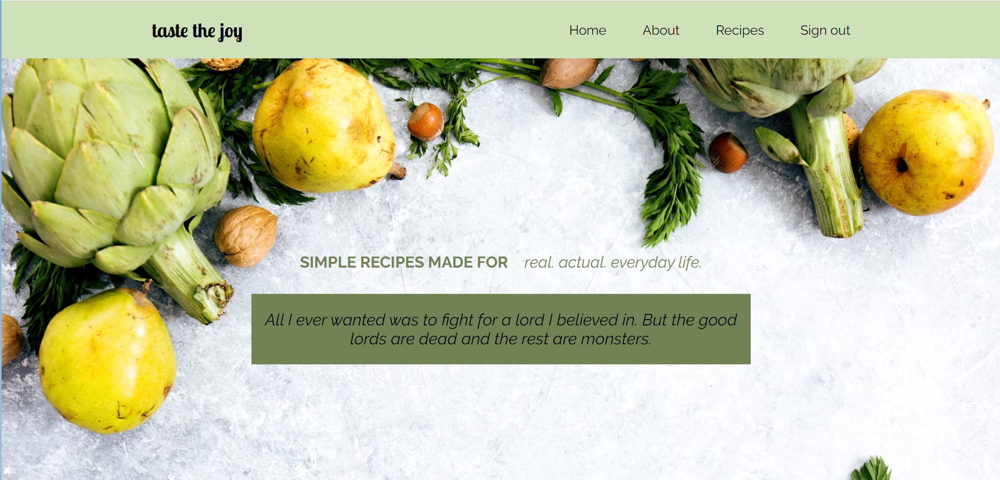

# Blog Application - Capstone Project

## Description

Taste the joy is a full-stack project that combines the power of MongoDB, Express, React and Node.js to deliver a user-friendly experience.

This SPA ensures a smooth user experience, making it easy to explore the variety of recipes and user reviews.

Users can not only browse recipes but also contribute to the community by adding their own reviews, and sharing insights with the other users.

Behind the scenes, I have used MongoDB and Mongoose to create an efficient way to store and manipulate the data, making the entire application responsive.

The application is a full CRUD system for recipes, reviews and user users profile.

I used the React library to render the Navbar component and Footer component, and also to create different views for the application. To navigate without refreshing pages I utilized React Router framework. To manage the state of the application I used the useState hook.

In order to provide an efficient way to share the user-related state across various components in application I used the useContext hook.

## Getting Started

Would you like to see the content of the page? Please use the following credentials to log in:( email: user1, password: password1) or create an account using the Sign Up button. Click this link to get access to the page: .

# Backend Configuration

## API Entities / Collection

1. Users
2. Recipes
3. Reviews

## Routes

Path: / Method: GET Description: Returns welcome message: "Welcome tot the API"!

## API Routes - CRUD

- User Routes

Path: /api/users Method: GET Description: Returns all users

Path: /api/users/:id Method: GET Description: Returns a single users selected by id

Path: /api/users Method: POST Body: {username: String, password: String} Description: Creates a new User

Path: /api/users/:id Method: PUT Description: Update an existing user selected by the id

Path: /api/users/:id Method: DELETE Description: Delete a user selected by the id

Path: /api/users/signup Method: POST Description: Allow the user to sign up and access the page

Path: /api/users/signin Method: POST Description: Allow the user to sign in and access the page

- Recipes Routes

Path: /api/recipes Method: GET Description: Returns all recipes

Path: /api/recipes/:id Method: GET Description: Returns a single recipe selected by id

Path: /api/recipes Method: POST Body: {title: String, image: String, ingredients: Array, instructions: Array} Description: Creates a new recipe

Path: /api/recipes/:id Method: PUT Description: Update an existing recipe selected by the id

Path: /api/recipes/:id Method: DELETE Description: Delete a recipe selected by the id

- Reviews Routes

Path: /api/reviews Method: GET Description: Returns all reviews

Path: /api/reviews/:id Method: GET Description: Returns a single review selected by id

Path: /api/reviews Method: POST Body: {user_id: ref: "Users", username: String, review: String} Description: Creates a new review

Path: /api/review/:id Method: PUT Description: Update an existing review selected by the id

Path: /api/review/:id Method: DELETE Description: Delete a review selected by the id

## Future updates

The blog application is going to have more features in the future.

1. I am going to implement a search bar for the user to search the recipes easily.
2. I am planning to create a section where users can add their own recipes.

## Resources

- [Trello website]("https://trello.com/b/V2Mymh3I/capstone-project-blog-app")

- [Draw.io]("https://app.diagrams.net/")

- [Mongoose Documentation]("https://mongoosejs.com/docs/")

- [Inspirational food blog]("https://pinchofyum.com/about)

- Stackoverflow :

1.  https://stackoverflow.com/questions/37669391/how-to-get-rid-of-underline-for-link-component-of-react-router

2.  https://stackoverflow.com/questions/18001478/referencing-another-schema-in-mongoose

## Other links

Link to the frontend repo: https://github.com/copilpatricia/capstone_project_frontend

Successfully deployed the backend here: https://blog-app-backend-nrpv.onrender.com

Successfully deployed the frontend here:
